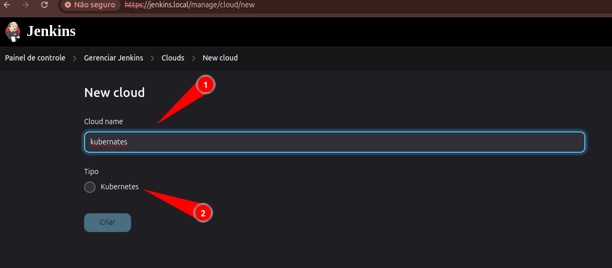
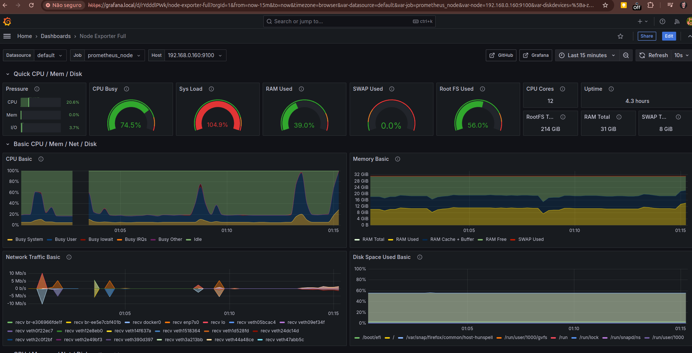

## Índice

* [Introdução](#introducao)
* [Docker Projetos](#docker-projetos)
  * [DNS local](#dns-local)
  * [Portas do network interno docker](#portas-do-network-interno-docker)
  * [Próximos passos](#próximos-passos)
* [Obter o IP do proxy](#obter-o-ip-do-proxy)
* [Configuração Nexus](./doc/nexus/README.md)
* [Configuração Jenkins](./doc/jenkins/README.md)
* [Configuração Sonar](./doc/sonar/README.md)
* [Configuração Kubernete](./doc/k3s/README.md)
* [Configuração Rancher](./doc/rancher/README.md)
* [Fazendo o deployment da aplicação redis](#fazendo-o-deployment-da-aplicação-redis)
* [Subindo a aplicação do projeto de estudo](#subindo-a-aplicação-do-projeto-de-estudo)
* [Deploy Contínuo com Jenkins e Kubernetes](#deploy-contínuo-com-jenkins-e-Kubernetes)
* [Usando o Prometheus](#usando-o-prometheus)
  * [Executado o node_exporter localmente](#executado-o-node_exporter-localmente)
* [Grafana](#grafana)
  * [Dashboard do node exporter no grafana](#dashboard-do-node-exporter-no-grafana)

## Introdução <a name="introducao"></a>

O objetivo desse projeto e juntar todo o estudo de devOps em containers docker. Os outros projetos de reposiório podem ser estudados separadamente. Um observação importante é que tudo está levando em consideração que o seu sistema operacional é o Ubuntu.

## Docker Projetos <a name="docker-projetos"></a>

Esse projeto usa o nginx para proxy reverso. Todos os containers estão com as portas fechados, só podendo ser acessados por proxy. Abaixo, devemos adicionar o DNS na nossa máquima, para facilitar o acesso aos projetos e estudos.

Um observação inportante é que nem todos os containers estão na mesmo **network do docker**.

Para iniciar, siga os passos abaixo:

1. Faça a ação do item [DNS local](#dns-local) para acessar as aplicações;
2. Execute o sh `./criar-certificados.sh`, para criar os certificados auto assinados;
3. Execute `./start.sh`. No processo, o container k3s será adicionado como node automaticamente. Mas detalhes [aqui](./doc/start/README.md);
4. Será aberto um browser direcionando para o [rancher](https://rancher.local/dashboard/auth/setup);
5. No `rancher`, o nosso container `K3s` aparecerá como node no cluster `local`;
6. Para continuar com as configurações iniciais, seguir os próximos passos.

## Próximos passos <a name="próximos-passos"></a>

Esse são os passos após iniciar o `./start.sh` informado no passo [Docker Projetos](#docker-projetos):

1. Configurar o [nexus](./doc/nexus/README.md);
2. Configurar o [jenkins](./doc/jenkins/README.md);
3. Configurar o [Sonar](./doc/sonar/README.md);
4. Configurar o [Kubernete - k3s](./doc/k3s/README.md);
5. Configurar o [Rancher](./doc/rancher/README.md);

Após as configurações, seguir com a subida do aplicação para testes no kubernete. Ir ao item [Fazendo o deployment da aplicação de estudo](README.md#fazendo-o-deployment-da-aplicação-de-estudo).

### DNS local <a name="dns-local"></a>

Recomendo nomes para facilitar nosso acesso aos containers:

```bash
sudo nano /etc/hosts
```

Edite o arquivo adicionando os nomes:

```bash
127.0.0.1 jenkins.local
127.0.0.1 sonar.local
127.0.0.1 nexus.local
127.0.0.1 k3s.local
127.0.0.1 rancher.local
127.0.0.1 redis.app
127.0.0.1 prometheus.local
127.0.0.1 prometheus.node
127.0.0.1 grafana.local
```

### Portas do network interno docker <a name="portas-do-network-interno-docker"></a>

As portas configuradas para as aplicações, podendo ser usadas apenas internamente dentro dos containers de mesmo network, pois todos as aplicações não estão expostas.

| APP | HTTP | HTTPS | OUTRO | DNS |
|---|---|---|---|---|
| Nginx | 80 | 443 | X | localhost |
| Jenkine | X | 9043 | 50000 | jenkins.local |
| SonarQube | 9000 | X | X | sonar.local |
| Nexus | X | 9143 | 8123 | nexus.local |
| K3S | 9280 | 9243 | 6443 | k3s.local |
| Rancher | 9380 | 9343 | X | rancher.local |
| Prometheus | 9090 | X | X | prometheus.local |
| Prometheus Node | X | X | 9100 | prometheus.node |


Para testar a porta:

```shell
telnet jenkins.local 9043
```

## Obter o IP do proxy <a name="obter-o-ip-do-proxy"></a>

Comando para obter o `ip` de um container:

```shell
docker inspect <nome_do_container> -f '{{range .NetworkSettings.Networks}}{{.IPAddress}}{{end}}' $(docker ps --filter name=reverse -q)
```

Exemplo para obter o `ip` do rancher:

```shell
docker inspect rancher-local -f '{{range .NetworkSettings.Networks}}{{.IPAddress}}{{end}}' $(docker ps --filter name=reverse -q)
```

## Fazendo o deployment da aplicação redis <a name="fazendo-o-deployment-da-aplicação-redis"></a>

Depois de tudo configurado vamos subir a nossa aplicação.

1. Vamos subir o redis que será usado pelo nossa aplicação. Dentro da pastas `k3s/yaml/redis.yaml`, temos a configuração do `Deployment` e do `Service`. Entre no `rancher-local` e execute o comando:
```shell
cd /opt/project/
kubectl create namespace estudo-redis-app
kubectl apply -f redis.yaml
```


```shell
kubectl get pod -n estudo-redis-app -o wide
```

O comando acima irá exibir o pod do redis.


O comando abaixo retorna mais detalhes do pod.

```shell
kubectl get pod -n estudo-redis-app -o wide
```

ou

```shell
kubectl describe pod redis-server-5678cd5ff6-f5j9p -n estudo-redis-app
```

Listando o serviço desse pod:

```shell
kubectl get svc -n estudo-redis-app
```


Para obter os `ips` do node, execute o comando abaixo:

```shell
kubectl get nodes -o wide
```

## Subindo a aplicação do projeto de estudo <a name="subindo-a-aplicação-do-projeto-de-estudo"></a>

**Obs:** Para a configuração de endereço DNS, estamos usando [https://sslip.io/](https://sslip.io/)

1. Vamos subir o nosso projeto. Dentro da pastas `k3s/yaml/redis-app.yaml`, temos a configuração do `Deployment`, do `Service` e o `Ingress`. Entre no `rancher-local` e execute o comando:
```shell
cd /opt/project/
kubectl create namespace estudo-redis-app # Se não existir
kubectl apply -f redis-app.yaml
```

Exibindo os pods:

```shell
kubectl get pod -n estudo-redis-app -o wide
```

Detalhe dos pods:

```shell
kubectl describe pod devops-app-deployment-5d46f94b5f-9nc6z -n estudo-redis-app
```

Ver o traefik:

```shell
kubectl get ingress --all-namespaces
kubectl describe ingress --all-namespaces
kubectl get -n kube-system svc | grep traefik
kubectl describe svc devops-app-service -n estudo-redis-app
kubectl get all -A # Listar tudo
```
---
Se tudo estiver ok, os pods estarão ok, conforme imagem abaixo:


## Deploy Contínuo com Jenkins e Kubernetes <a name="deploy-contínuo-com-jenkins-e-Kubernetes"></a>

```shell
docker compose exec rancher cat /var/lib/rancher/k3s/server/node-token
curl -sfL https://get.k3s.io | K3S_URL=https://rancher:6443 K3S_KUBECONFIG_MODE=644 K3S_NODE_NAME=k3s-node-jenkins K3S_TOKEN=K10d96373e8787b584621199368feaf903897e1ae36146ea3160701bc053bd5a730::server:5171807aeebfea617047bbb2e8366fa6 sh -
```

Para integrar o Jeknins com o Kubernetes, é preciso instalar o plug-in abaixo:


Para verificar se o container jenkins tem acesso ao container do rancher-loca, execute o comando abaixo no container do jenkins:


Agora vamos configurar o nós cloud para esse acesso ao Kubernetes:


New cloud:


Tipo Kubernetes:



### Antes de continuar, precisamos criar as credenciais no Kubernete (rancher-local)

Acesse o container dp `rancher-local` e execute os comandos abaixo:

Criando o service account:

```shell
kubectl create serviceaccount jenkins -n estudo-redis-app
```

Crie uma associação de função com base na permissão necessária para o aplicativo usando o código abaixo:

```shell
cat <<EOF | kubectl create -f -
apiVersion: rbac.authorization.k8s.io/v1
kind: ClusterRoleBinding
metadata:
 name: jenkins-integration
 labels:
   k8s-app: jenkins-image-builder
roleRef:
  apiGroup: rbac.authorization.k8s.io
  kind: ClusterRole
  name: cluster-admin
subjects:
- kind: ServiceAccount
  name: jenkins
  namespace: estudo-redis-app
EOF
```

Crie um segredo para a conta de serviço Jenkins:

```shell
cat <<EOF | kubectl create -f -
apiVersion: v1
kind: Secret
type: kubernetes.io/service-account-token
metadata:
 name: jenkins
 namespace: estudo-redis-app
 annotations:
   kubernetes.io/service-account.name: jenkins
EOF
```

Em seguida, extraia o token usando o comando abaixo:

```shell
kubectl get secrets jenkins -n estudo-redis-app -o jsonpath='{.data.token}' | base64 -d
```


Também é possível obter o token no rancher:


### Depois de obter o token no k3s, voltar com a configuração no jenkins

Criar as credenciais com o token obtido no k3s:


Depois continuar com a configuração do agente Kubernete:


- **Name**: Kubernetes
- **Kubernetes URL**: https://rancher:6443
- **Disable https certificate check**: true
- **Credentials**: jenkins-k3s
- **WebSocket**: true

## Usando o Prometheus <a name="usando-o-prometheus"></a>

Para fins de demonstração, o Prometheus está sendo executado em um contêiner denominado `prometheus`. Para coletar métricas da máquina hospedeira, utilizaremos o `node_exporter`, um exporter específico para sistemas operacionais, disponível em [https://prometheus.io/download/](https://prometheus.io/download/). O `node_exporter` coletará diversas métricas de sistema, como utilização de CPU, memória, disco e rede, e as enviará para o Prometheus em intervalos regulares. Essas métricas serão armazenadas e disponibilizadas pelo Prometheus para visualização e análise.

#### Executado o node_exporter localmente <a name="executado-o-node_exporter-localmente"></a>

Execute o comando abaixo na pasta do `node_exporter`:

```shell
nohup ./node_exporter &
```

Como seguimos a configuração do `/etc/hosts` o endereço do `prometheus` é [http://prometheus.node:9100/](http://prometheus.node:9100/).

Para que o `prometheus` acesse o `node_exporter`, o container sober com a seguinte configuração:

- Local do volume: `prometheus/prometheus.yml`
- Configuração do `static_configs`: http://192.168.0.160:9100/

Usamos o endereço IP da máquina host.


**Observação:** O `prometheus` está configurado na porta 80 do nginx.


## Grafana <a name="grafana"></a>

Temos um container com o `Grafana` para acessar a documetação: [https://grafana.com/docs/grafana/latest/setup-grafana/installation/docker/](https://grafana.com/docs/grafana/latest/setup-grafana/installation/docker/).

Para acessar primeiramente do grafana use:

- Login: admin
- Pass: admin

**Observação:** Para criar um novo datasource, é preciso configurar o nginx conforme abaixo (já configurado):


#### Dashboard do node exporter no grafana <a name="dashboard-do-node-exporter-no-grafana"></a>

Baixar no endereço: [https://github.com/rfrail3/grafana-dashboards](https://github.com/rfrail3/grafana-dashboards/tree/master/prometheus) ou use em `grafana/dashboard/node-exporter-full.json`.


Só escolher o tipo de dados:


O dashboard importado:


### Teste de stress

Para validar consumo dos dados via agente.

Instale:

```shell
sudo apt-get install epel-release
sudo apt-get install stress
```

Execute e veja no dashboard do grafana:

```shell
sudo stress --cpu 12 --io 8 --vm 4 --vm-bytes 1G --timeout 30s
```

