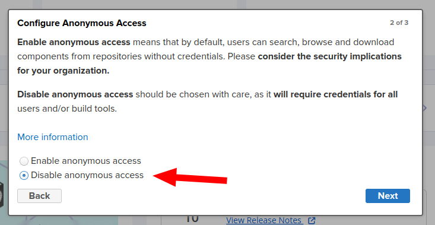
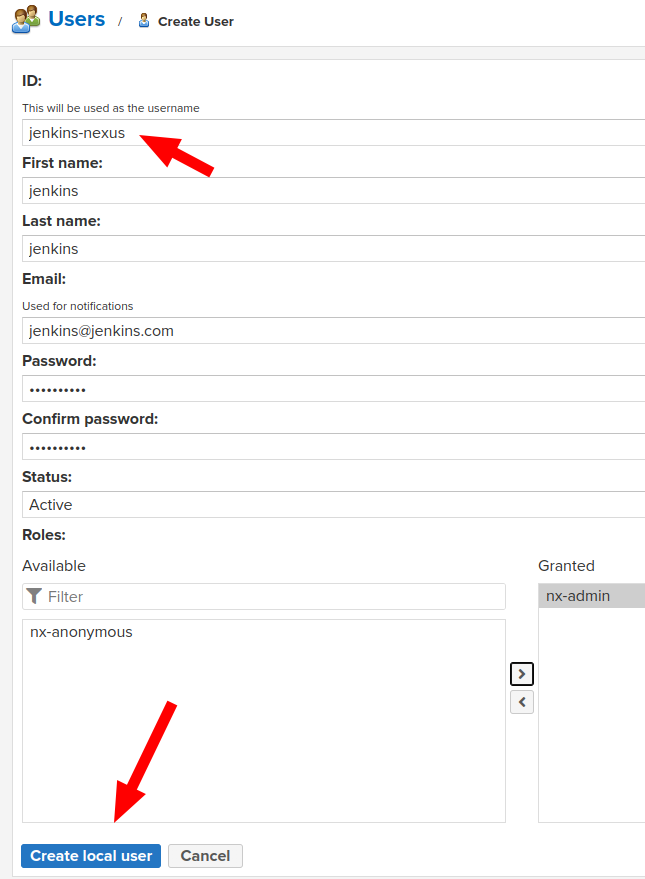

## Índice

* [Primeiro login](#primeiro-login)
* [Criando usuário para integração com o jenkins](#criando-usuário-para-integração-com-o-jenkins)
* [Criar um docker repo](#criar-um-docker-repo)

[Voltar](../../README.md)

# Nexus

O nexus iremos guardar nossas imagens e artefatos. Para acessar: [nexus.local](https://nexus.local).

## Primeiro login 

Por padrão, o usuário é `admin` e senha é `admin123` no login inicial, podendo ser modificado a qualquer momento.

Aqui é de sua escolha.

Finalizado.

## Criando usuário para integração com o jenkins 

Para a integração com o jenkins, criar um usuário login `jenkins` e senha `jenkins123`. É preciso criar no Jenkins, nas credenciais, com ID `jenkins-nexus` e usar o login e senha criados no nexus. Isso está na documentação do [Jenkins](../jenkins/README.md).

Preencher os dados.

Preencher conforme os dados para ser utilziado no jenkins.

Usuário criado.

## Criar um docker repo 

Criar um repositório para as imagens docker (registry docker). Será usado pelo `jenkins` e pelo `kubernate`. Todas as imagens criadas serão guardadas no nexus e usadas no `kubernate` par ao deploy das aplicações.

- Repositories
  - docker (hosted)
    - nome: `docker-repo`
    - HTTPS: `8123` | Exposto lá no docker compose

Criar um hosted para as imagens do docker.

Adicionando os dados do repositório (registry para o k3s).

Repositório criado.

---
[Voltar](../../README.md)