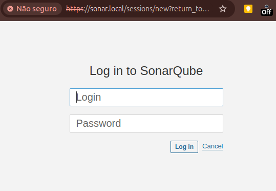
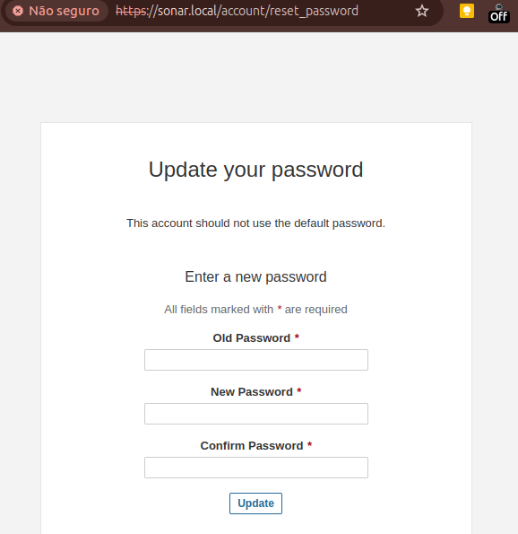
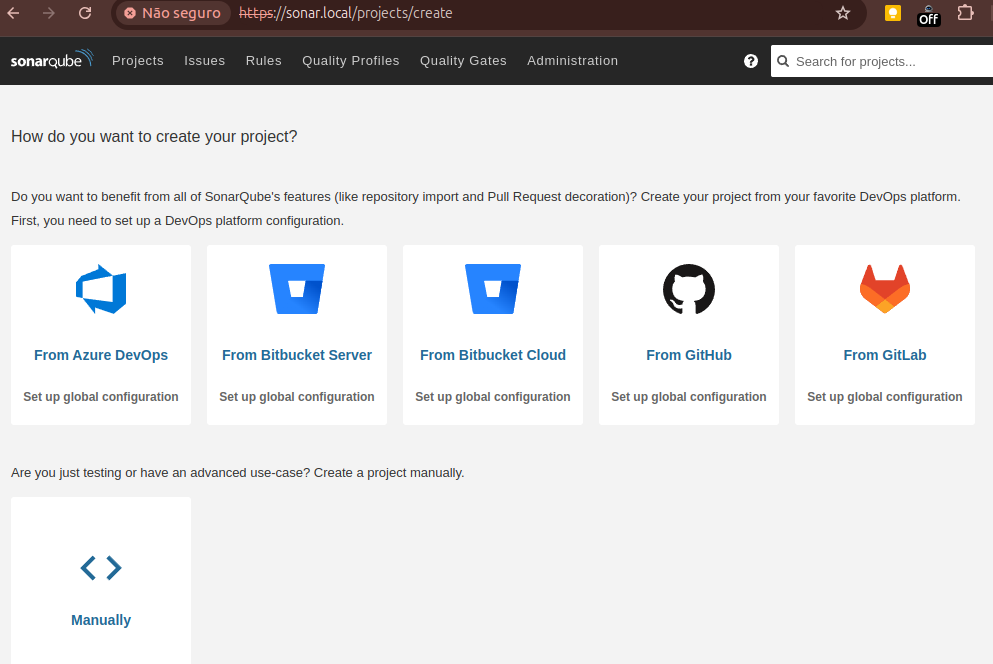
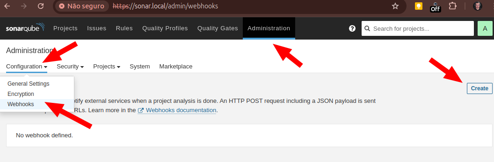
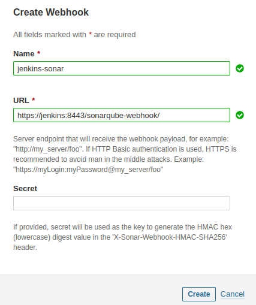
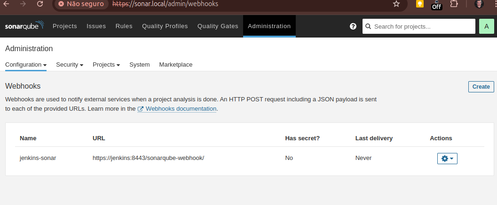
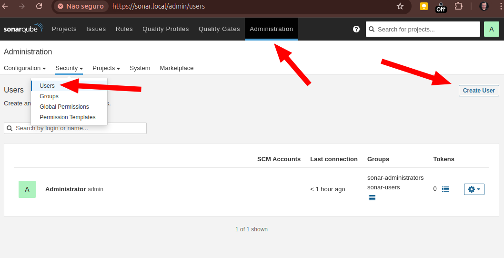
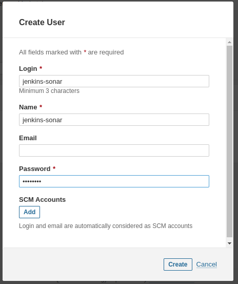
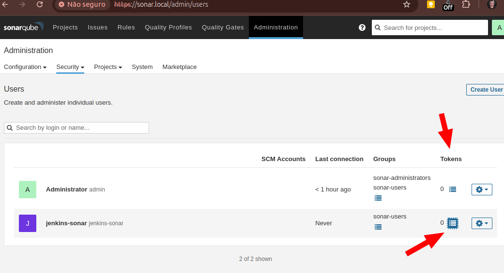
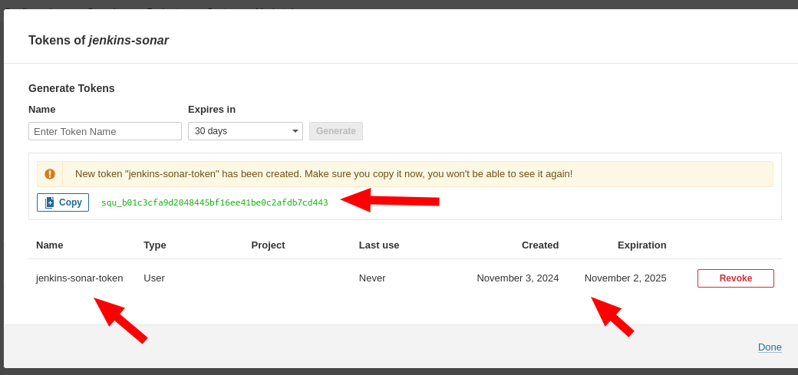

## Índice

* [Sonarqube](#sonarqube)
* [Associado ao projeto jenkins](#associado-ao-projeto-jenkins)
* [Criar o secret para ser usada no jenkins](#criar-o-secret-para-ser-usada-no-jenkins)

[Voltar](../../README.md)

# Sonarqube 

Acesse o link: [sonar.local](http://sonar.local). Na primeira instalação, o login e senha são `admin`.

## Associado ao projeto jenkins 

Para retonar o resultado para o jenkins, configurar o Webhooks lá no sonarQube: [sonar.local/admin/webhooks](http://sonar.local/admin/webhooks).

Adicionar:

- **Name**: `jenkins-sonar`
- **URL**: `https://jenkins:8443/sonarqube-webhook/`

### Observação

Se o webhook não funcionar, ve a [documentação do jenkins](../jenkins/README.md), no passo "Webhook não funcionou".

## Criar o secret para ser usada no jenkins 

Para o jenkins ter acesso ao sonar, precisamos criar um usuário e criar uma secret.

Criar um novo usuário para o jenkins.

- **Login**: jenkins-sonar
- **Name**: jenkins-sonar
- **Password**: jenkins123

Agora precisamos criar um token para ele, e adicionar lá no jenkins. [Ver documentação do jenkins](../jenkins/README.md).

Criar o token e usar no jenkins.

- **Name**: jenkins-local-token
- **Expires in**: 1 year

---
[Voltar](../../README.md)
