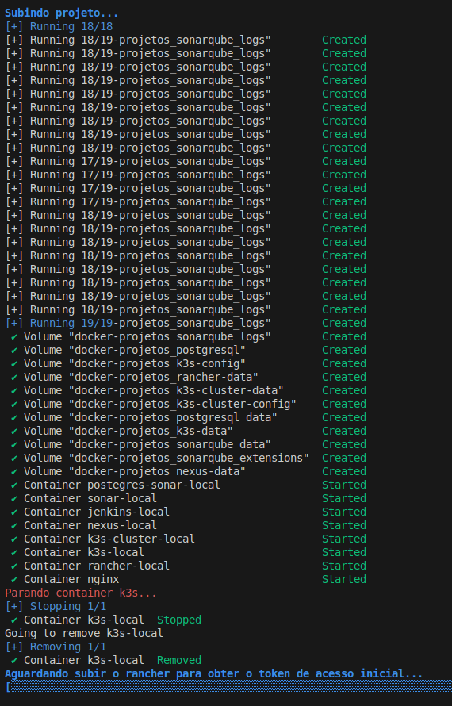
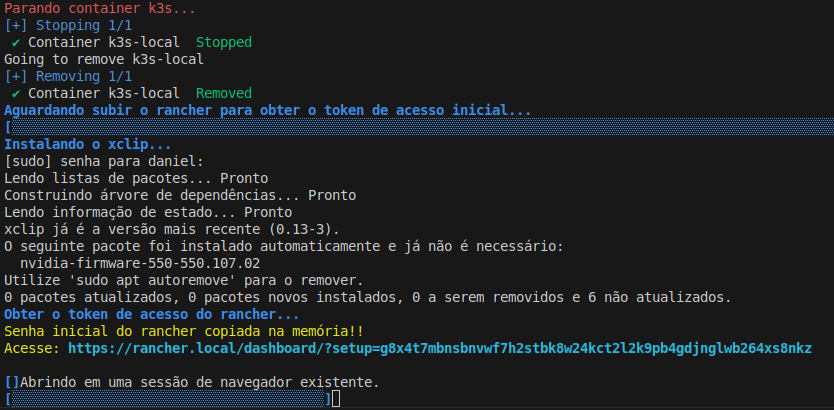
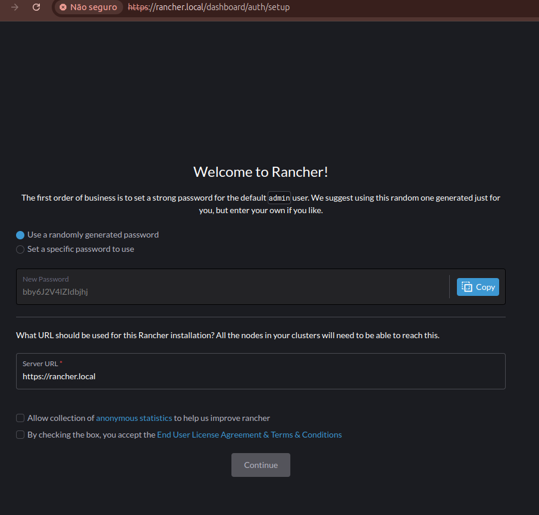
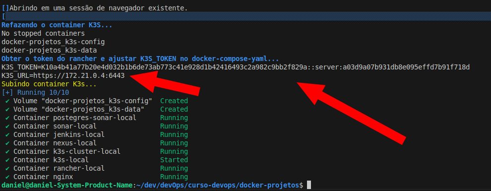
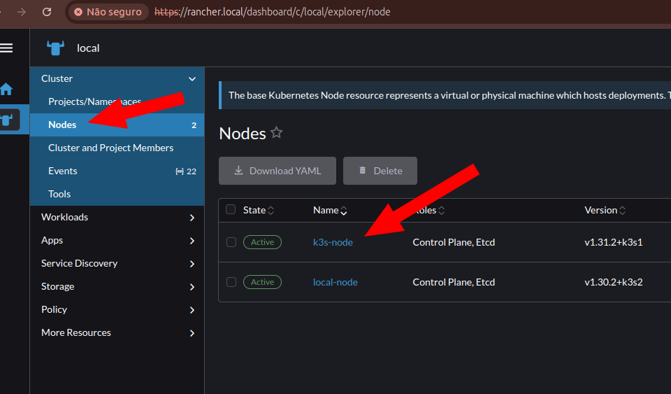

## Índice

* [Start do projeto](#start-do-projeto)
* [Iniciando](#iniciando)
* [Reiniciando o k3s-local](#reiniciando-o-k3s-local)
* [Acessando o Rancher](#acessando-o-rancher)
* [Confirmação da subida do k3s-local como node do Rancher](#confirmação-da-subida-do-k3s-local-como-node-do-rancher)

[Voltar](../../README.md)

# Start do projeto <a name="start-do-projeto"></a>

Para o projeto, criei um script shell para iniciar todo o projeto mas antes é preciso executar o `criar-certificados.sh` para criar todos os certificados autoassinados para serem usado no `HTTPS` e no `Nginx`.

Abaixo, um passo a passo do processo:

### Iniciando <a name="iniciando"></a>

Aqui, ao iniciar o script `./start.sh`, os contêineres são iniciados e quando todos sobem, obtemos o token no rancher e adicionarmos no `docker-compose.yml` automaticamente e reiniciamos `k3s-local`, pois esse será adicionado como node no rancher.




### Reiniciando o k3s-local  <a name="reiniciando-o-k3s-local"></a>

Após reiniciar, também pegamos o token de acesso inical ao rancher. Instalamos o `xclip` como `sudo` e abrimos o browser para o rancher já com o token.
Caso o browser não abra, só copiar a url que aparece no console e usar.




### Acessando o Rancher  <a name="acessando-o-rancher"></a>

Se abrir automaticamente, ou pela url do console, informe uma nova senha e entre no `rancher`.




### Confirmação da subida do k3s-local como node do Rancher  <a name="confirmação-da-subida-do-k3s-local-como-node-do-rancher"></a>

Para adicionar um nó no rancher, só obter o token gerado por ele no script abaixo. O meu script já faz isso automaticamente.
script abaixo. O meu script já faz isso automaticamente.

```shell
docker compose exec rancher cat /var/lib/rancher/k3s/server/node-token ## Obter o token no rancher.
docker inspect rancher-local -f '{{range .NetworkSettings.Networks}}{{.IPAddress}}{{end}}' ## Obter o ip do rancher se necessário.
```



O node adicionado no Rancher.


___
[Voltar](../../README.md)